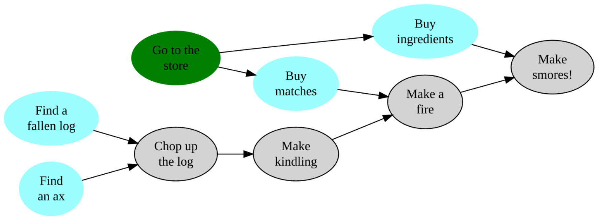

# bdgraph

bdgraph is a tool for converting simply formatted files into handy graphviz
dot files.  It's great for managing complicated projects where steps have
multiple dependencies on each other!



## Options 

bdgraph has several *optional* options that you can enable by adding them to
the options section of your input file. Really, the whole options section is
optional itself! If the option has a symbol, you enable it for one node at a
time; see `6:` in the example below.

| Option         | Symbol   | Effect                                                              |
| ------         | :------: | ----                                                                |
| color_complete | @        | highlight nodes in green                                            |
| color_urgent   | !        | highlight nodes in red                                              |
| remove_marked  | &        | safely delete this node                                             |
| color_next     |          | auto highlight nodes that don't have any unmet dependencies in blue |
| cleanup        |          | tells bdgraph to reorganize your input file                         |
| circular       |          | generate a more circular output graph                               |
| publish        |          | remove node count from output graph                                 |
| no_reduce      |          | do not apply transitive reduction algorithm                         |


## Dependencies

The dependencies section tells bdgraph how your information is related. It uses a simple
syntax in which '1 -> 2' means '2' relies on '1'. What this means is up to you! I've
used it for relating references in papers and for to-do lists. Identation and spacing
are entirely optional.

### Here's an example!
```haskell
   1: Find a fallen log
   2: Find an ax
   3: Chop up the log
   4: Make kindling
   5: Make a fire
   6: @Go to the store
   7: Buy ingredients
   8: Buy matches
   9: Make smores

options
  color_next
  color_complete
  cleanup

dependencies
  3 <- 1,2
  4 <- 3
  5 <- 4,8
  6 -> 8,7
  9 <- 5,7
```
### bdgraph uses this to generate the following:

Which you can then paste or open in any dot file viewer to get the nice image
at the top!

```haskell
digraph g{
  rankdir=LR;
  ratio=fill;
  node [style=filled];
  "Find a\n fallen log" [color="lightskyblue"]
  "Find\n an ax" [color="lightskyblue"]
  "Find a\n fallen log"  -> "Chop up\n the log"
  "Find\n an ax"  -> "Chop up\n the log"
  "Chop up\n the log"
  "Chop up\n the log"  -> "Make\n kindling"
  "Make\n kindling"
  "Make\n kindling"  -> "Make a\n fire"
  "Buy\n matches"  -> "Make a\n fire"
  "Make a\n fire"
  "Go to the\n store" -> "Buy\n matches" 
  "Go to the\n store" -> "Buy\n ingredients" 
  "Go to the\n store" [color="springgreen"];
  "Buy\n ingredients" [color="lightskyblue"]
  "Buy\n matches" [color="lightskyblue"]
  "Make a\n fire"  -> "Make\n smores!"
  "Buy\n ingredients"  -> "Make\n smores!"
  "Make\n smores!"
}
```

## That's it!
```
git clone https://github.com/Gandalf-/bdgraph.git
sudo ln -s bdgraph/bdot /usr/local/bin/
```
